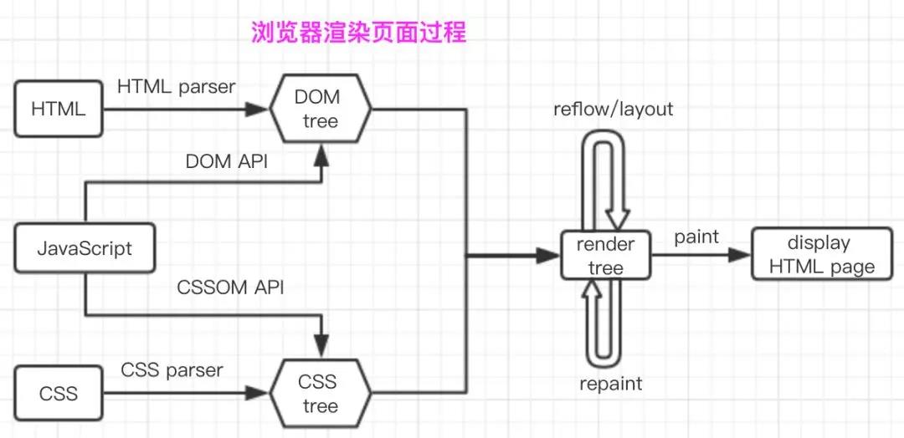

# Doctype作用? 严格模式与混杂模式如何区分？它们有何意义?
1. <!DOCTYPE> 声明位于文档中的最前面，处于 <html> 标签之前。告知浏览器的解析器，什么文档类型 规范来解析这个文档。
2. 严格模式的排版和 JS 运作模式是  以该浏览器支持的最高标准运行。
3. 在混杂模式中，页面以宽松的向后兼容的方式显示。模拟老式浏览器的行为以防止站点无法工作。
4. DOCTYPE不存在或格式不正确会导致文档以混杂模式呈现。

# HTML5 为什么只需要写 '!DOCTYPE HTML'？
HTML5 不基于 SGML，因此不需要对DTD进行引用，但是需要doctype来规范浏览器的行为（让浏览器按照它们应该的方式来运行）；

而HTML4.01基于SGML,所以需要对DTD进行引用，才能告知浏览器文档所使用的文档类型。

# 行内元素有哪些？块级元素有哪些？ 空(void)元素有那些？
1. 行内元素：span、img、a、lable、input、abbr（缩写）、em（强调）、big、cite（引用）、i（斜体）、q（短引用）、textarea、select、small、sub、sup，strong、u（下划线）、button（默认display：inline-block）。
2. 块级元素：div、p、h1~h6、ul、ol、dl、li、dd、table、hr、blockquote、address、table、menu、pre，HTML5新增的header、section、aside、footer等。
3. 空元素：link、meta、base等。

# link 和@import 的区别是？
1. link属于XHTML标签，而@import是CSS提供的;
2. 页面被加载的时，link会同时被加载，而@import引用的CSS会等到页面被加载完再加载;
3. import只在IE5以上才能识别，而link是XHTML标签，无兼容问题;
4. link方式的样式的权重 高于@import的权重.

# 介绍一下你对浏览器内核的理解？
主要分成两部分：渲染引擎(layout engineer或Rendering Engine)和JS引擎。

渲染引擎：负责取得网页的内容（HTML、XML、图像等等）、整理讯息（例如加入CSS等），以及计算网页的显示方式，然后会输出至显示器或打印机。浏览器的内核的不同对于网页的语法解释会有不同，所以渲染的效果也不相同。所有网页浏览器、电子邮件客户端以及其它需要编辑、显示网络内容的应用程序都需要内核。

JS引擎则：解析和执行javascript来实现网页的动态效果。

最开始渲染引擎和JS引擎并没有区分的很明确，后来JS引擎越来越独立，内核就倾向于只指渲染引擎。

# 浏览器的内核分别是什么?
- Trident：IE
- Gecko：FF
- Presto/Blink：Opera
- Webkit：Safari,Chrome

# 常见兼容性问题？
- Chrome 中文界面下默认会将小于 12px 的文本强制按照 12px 显示,
可通过加入 CSS 属性 -webkit-text-size-adjust: none; 解决。
- png24位的图片在iE6浏览器上出现背景，解决方案是做成PNG8。

# Html5有哪些新特性？
- 移除了一些存表现得元素（basefont，big，center，font, s，strike，tt，u）和对可用性产生负面影响的元素（frame，frameset，noframes）。
- 新增了一些语义化标签（header footer section aside article nav等）和表单控件（date search等）。
- 提供了更多的能力：Canvas、video&audio、localStorage&sessionStorage等。

# 语义化的理解？
用正确的标签做正确的事情！
html语义化就是让页面的内容结构化，便于对浏览器、搜索引擎解析；
在没有样式CCS情况下也以一种文档格式显示，并且是容易阅读的。
搜索引擎的爬虫依赖于标记来确定上下文和各个关键字的权重，利于 SEO。
使阅读源代码的人对网站更容易将网站分块，便于阅读维护理解。

# iframe有那些缺点？
iframe会阻塞主页面的Onload事件；
搜索引擎的检索程序无法解读这种页面，不利于SEO;

iframe和主页面共享连接池，而浏览器对相同域的连接有限制，所以会影响页面的并行加载。

使用iframe之前需要考虑这两个缺点。如果需要使用iframe，最好是通过javascript
动态给iframe添加src属性值，这样可以绕开以上两个问题。

# cookies，sessionStorage 和 localStorage 的区别？
cookie在浏览器和服务器间来回传递。 sessionStorage和localStorage不会

存储大小：cookie数据大小不能超过4k。sessionStorage和localStorage 虽然也有存储大小的限制，但比cookie大得多，可以达到5M或更大。

有期时间：
localStorage：存储持久数据(目前业界基本上统一为5M)，浏览器关闭后数据不丢失除非主动删除数据；
 sessionStorage：数据在当前浏览器窗口关闭后自动删除。 
 cookie：设置的cookie过期时间之前一直有效，即使窗口或浏览器关闭。

 # HTML5的form如何关闭自动完成功能？
给不想要提示的 form 或下某个input 设置为 autocomplete=off。

# 页面可见性（Page Visibility）API 可以有哪些用途？
在页面被切换到其他后台进程的时候，自动暂停音乐或视频的播放。

# 如何在页面上实现一个圆形的可点击区域？
1. map+area或者svg
2. border-radius
3. 纯js实现 需要求一个点在不在圆上简单算法、获取鼠标坐标等等

# 实现不使用 border,画出1px高的线，在不同浏览器的标准模式与怪异模式下都能保持一致的效果
```
<div style="height:1px;overflow:hidden;background:#ccc"></div>
```

# 元素水平垂直居中的方法
1. absolute配合margin: auto
2. margin负值（或者translate负值）
3. flex布局

# 如果需要手动写动画，你认为最小时间间隔是多久，为什么？（阿里）
一秒刷新60次，所以是16.7ms

# overflow: scroll时不能平滑滚动的问题怎么处理？
`-webkit-overflow-scrolling:touch;  `因为这行代码启用了硬件加速特性，所以滑动很流畅

# ::before 和 :after中双冒号和单冒号 有什么区别？解释一下这2个伪元素的作用。
双冒号是伪元素，单冒号是伪类。

---
---
# 浏览器渲染过程？

1. 浏览器通过HTMLParser根据深度遍历的原则把HTML解析成DOM Tree。
2. 将CSS解析成CSS Rule Tree（CSSOM Tree）。
3. 根据DOM树和CSSOM树来构造render Tree。
4. layout（布局）：根据得到的render tree来计算所有节点在屏幕的位置。
5. paint（绘制）：遍历render树，并调用硬件图形API来绘制每个节点。

# 重排和重绘及渲染优化？
1. 重排就是需要重新布局。改变元素的宽高位置等会导致重排。
2. 重绘就是需要重新绘制。改变元素的颜色、背景色及可见性（visibility）等会导致重绘。
3. 重绘不一定会导致重排，但重排一定会导致重绘。
4. 优化：
1) 最小化重排和重绘，把对DOM的多次操作合并成一次，比如修改某元素的多个样式可以修改cssText,也可以直接改变className。
2) 将需要多次重排的元素脱离文档流，这样重排时不会影响到其他元素。
3) display：none；先设置元素为display：none；然后进行页面布局等操作；设置完成后将元素设置为display：block；这样的话就只引发两次重排和重绘。


# 盒模型
1. 有两种， IE 盒子模型、标准 W3C 盒子模型；IE的content部分包含了 border 和 pading;
2. 盒模型： 内容(content)、填充(padding)、边界(margin)、 边框(border).

# 文档流的理解
1. 元素在文档中从左至右从上至下排列，块级元素独占一行，行内元素可以在水平方向上紧挨着排列。
2. 浮动和绝对定位可以脱离文档流。

# 负margin的理解
负的margin-left和margin-right会增加元素的宽度。负的margin-top会使元素在文档流中上移。负的margin-bottom会使紧跟在该元素后的兄弟元素在文档流中上移，表现上就好像后面的兄弟元素覆盖在了该元素上一样。

# BFC的理解
参考[方应杭的网课](https://xiedaimala.com/tasks/4cdc74ef-b8b2-4cbd-aa4e-7a8ee7ad3a16)
1. 如何创建一个BFC：
浮动、绝对定位、非块盒的块容器、overflow不为visible的值、display: flow-root都能创建一个BFC
```
/* 使用以下任何一条规则都能使一个容器成为一个BFC */
float: left;
position: absolute;
overflow: auto;
display: inline-block;
display: table-cell;
display: table-caption;
/* 直接触发BFC */
display: flow-root;
```
2. BFC的功能：
1) 包住它的所有子元素（子元素如果也是BFC，它会自己管理自己的子孙），可以做清除浮动的功能（不推荐）。
2) 和其他兄弟元素划清界限，可以做一列固定一列自适应的两列布局（不推荐）。

# float的理解

# line-height的理解

# vertical-align的理解

# flex布局的理解

# 视差滚动效果
存css实现：`background-attachment: fixed`

# sticky footer

# 圣杯布局和双飞翼布局
都是**三列布局，左右两列定宽，中间列自适应**的解决方案

# 动画
