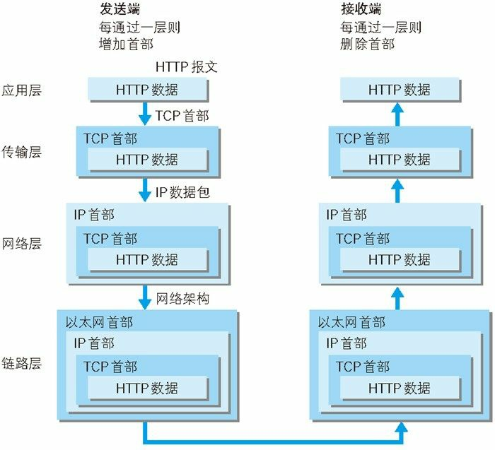
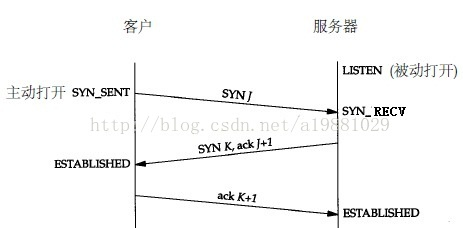
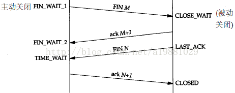

# 网络基础
## TCP/IP协议族
TCP/IP协议族分层管理：应用层、传输层、网络层和数据链路层。

**应用层**包括：FTP(File Transfer Protocol, 文件传输协议)，DNS(Domain Name System, 域名系统)和HTTP(HyperText Transfer Protocol, 超文本传输协议)等。

**传输层**包括：TCP(Transmission Control Protocol, 传输控制协议)和UDP(User Data Protocol, 用户数据报协议)。

**网络层**：规定了通过怎样的路径（传输路线）到达对方计算机，并把数据包传输给对方。**数据包**是网络传输的最小数据单位。

**数据链路层**：用来处理网络的硬件部分，网卡，光纤，操作系统等。

网络通信发生时，发送端从应用层往下走，接收端往应用层往上走。发送端每经过一层，就会打上一个对应层的首部信息；接收端每经过一层就会消去对应曾的首部信息。这种把数据消息包装起来的做法称为 **封装**。

## 负责传输的IP协议
IP(Internet Protocol, 网际协议)位于网络层，作用是传送各种数据包。传送需要IP地址和MAC(Media Access Control, 媒体访问控制)地址。IP地址可变，MAC地址一般不变。

ARP(Address Resolution Protocol, 地址解析协议)可以把IP地址解析为MAC地址。如果不在同一个局域网内，需要中转到下一个MAC地址。就像快递公司送货过程。

## 确保可靠性的TCP协议
TCP位于传输层，提供可靠的字节流服务。字节流服务是指把大块数据分割成以 **报文段** 为单位的数据包。可靠是指数据包可以准确的送达对方。为了确保这种准确，TCP采用 **三次握手** 策略。

## 负责域名解析的DNS
DNS协议可以通过域名查找IP,也可以通过IP反查域名。

## 请求网页的过程：
1. 客户端输入域名，DNS返回对应的IP地址
2. HTTP生成请求报文
3. TCP把报文按顺序分割成一个个报文段，并通过三次握手传送给对方
4. IP协议查询MAC地址，并把报文段通过一个个中转站最终传送到目标MAC地址
5. TCP通过三次握手接收到一个个报文段，并把报文段按顺序重组成请求报文
6. HTTP协议处理请求报文并返回响应资源。

## URI、URL和URN
URI(Uniform Resource Identifer, 统一资源标识符)，URL(Uniform Resource Locator, 统一资源标识符)和URN(Uniform Resource Name, 统一资源名称)

URN和URL是URI的子集。URL和URN一定是URI，反之不一定成立。形如`http://abc.om`既是URI也是URL。但是`abc.com`是URI却不是URL，因为`http://abc.com`和`ftp://abc.com`代表了两个不同的locator。

映射到生活中，我说起赵日天你一定知道我说的是谁（URN），但是你要去赵日天家里做客，你必须要知道他家的地址（URL)。

# HTTP概况
1. HTTP协议总是客户端请求，服务端响应。
2. HTTP不保存状态，所以有了cookie。
3. HTTP请求的方法。
4. 持久连接和管线化。

# HTTP报文
1. 请求报文和响应报文拥有一致的基本结构：报文首部 + 空行 + 报文主体。
2. 请求报文的报文首部：请求行 + 请求首部字段 + 通用首部字段 + 实体首部字段 + 其他。
3. 响应报文的报文首部：状态行 + 状态首部字段 + 通用首部字段 + 实体首部字段 + 其他。
4. 请求行：请求方法 + 请求URI + HTTP版本。例如：GET http://abc.com HTTP/1.1
5. 状态行: HTTP版本 + 状态码 + 原因短语。例如：HTTP/1.1 200 OK

# 状态码
1. 1xx: 信息性状态码
2. 2xx: 成功状态码
3. 3xx: 重定向状态码
4. 4xx: 客户端错误状态码
5. 5xx: 服务端错误状态码
- 200 OK 成功
- 204 No Content 响应报文主体无实体
- 206 Partial Content 范围请求内容，Content-Range指定
- 301 Moved Permanently 永久性重定向
- 302 Found 临时性重定向
- 303 See Other 资源存在另外的URI，应当访问这个URI
- 304 Not Modified 资源未更改，客户端发送附带条件的请求，GET If-Match，If-Modified-Since，If-None-Match，If-Range，If-Unmodified-Since
- 307 Temporary Redirect 临时重定向
- 400 Bad Request 请求报文语法错误，浏览器会像对待200OK一样对待
- 401 Unauthorized 认证未通过
- 403 Forbidden 禁止访问
- 404 Not Found 访问的资源找不到
- 500 Internal Server Error 服务端执行错误
- 503 Service Unavailable 服务器超负荷或维护中

# Web服务器
## 用单台虚拟主机实现多个域名
用单台虚拟主机实现多个域名时，物理层面只有一台服务器，但是可以托管多个域名。

这样就有一个问题：访问域名的时候，DNS会把域名解析为IP地址，这样虚拟主机上的多个域名会被解析成同一个IP地址，比如 http://abc.com/index.html 和 http:def.com/index.html 可能都被解析成了 http://192.168.1.1/index.html， 服务器要怎么区分到底是响应哪个域名下的index.html文件呢？

解决：在发送HTTP请求时，必须在HOST首部内完整指定主机名或域名的URI。比如：Host: abc.com，这样服务器就知道怎么响应了。

## 代理、网关和隧道
### 代理
1. 代理服务器在客户端和源服务器之间充当“中间人”角色。
2. 通信过程可以级联多台代理服务器，每经过一台代理服务器就会附加一个**Via首部字段**以标记出经过的主机信息。
3. 代理服务器按两种基准分类：是否使用缓存，是否修改报文。即缓存代理和透明代理（对应非透明）。

### 网关
1. 网关可以把提供非HTTP协议服务，比如网关可以接收到HTTP请求后转发成其他非HTTP协议的通信，在收到非HTTP服务器的响应后再把响应内容用HTTP相应给客户端。
2. 利用网关能提高通信的安全性。

### 隧道
1. 隧道可以和远距离的服务器通过SSL等加密手段建立安全通信。
2. 隧道时透明的，不会解析HTTP请求。
3. 隧道会在通信双方断开连接时结束。

## HTTP缓存
- 数据库缓存
- 服务器缓存
  - 代理服务器缓存
  - CDN缓存
- **浏览器缓存**
  - **HTTP缓存**
  - indexDB
  - cookie
  - localStorage

1. HTTP缓存通过头信息控制，分为两种：**强缓存**和**协商缓存**，强缓存如果命中则不需要和服务器发生交互，协商缓存不管命中与否都要和服务器发生交互。
2. 浏览器发送请求前根据Expieres或Catch-Control（优先级更高）来判断是否命中强缓存。
3. 如果命中强缓存,则直接从浏览器缓存中获取资源。如果未命中强缓存，则向服务器发起请求（此时服务器只返回首部信息）。
4. 根据服务器响应的头信息中的Last-Modified或Etag（优先级更高）判断是否命中协商缓存。
5. 如果命中协商缓存，则从浏览器缓存中获取资源。如果未命中协商缓存，则从服务器获取资源

参考：
- [HTTP 缓存机制一二三](https://zhuanlan.zhihu.com/p/29750583)

# 三次握手
建立一个TCP连接前需要三次握手

- SYN: 建立一个连接
- FIN: 关闭一个链接
- ACK: 确认接收数据

1. 客户端发送syn包(syn=j)到服务器，并进入SYN_SEND状态，等待服务器确认。
2. 服务器收到syn包，必须确认客户的SYN（ack=j+1），同时自己也发送一个SYN包（syn=k），即SYN+ACK包，此时服务器进入SYN_RECV状态。
3. 客户端收到服务器的SYN＋ACK包，向服务器发送确认包ACK(ack=k+1)，此包发送完毕，客户端和服务器进入ESTABLISHED状态，完成三次握手。

# 四次挥手
关闭一个TCP连接需要四次挥手

1. 客户端：FIN = m
2. 服务端：ACK = m + 1
3. 服务端：FIN = n
4. 客户端：ACK = n + 1
5. 四次挥手结束，断开TCP连接

# 从输入URL到浏览器显示页面发生了什么
## 网络通信
1. 用户输入URL，浏览器获取到URL
2. 浏览器(应用层)进行DNS解析（如果输入的是IP地址，此步骤省略）
3. 根据解析出的IP地址+端口，浏览器（应用层）发起HTTP请求
4. 请求到达传输层，tcp协议为传输报文提供可靠的字节流传输服务，它通过三次握手等手段来保证传输过程中的安全可靠。通过对大块数据的分割成一个个报文段的方式提供给大量数据的便携传输。
5. 到网络层， 网络层通过ARP寻址得到接收方的Mac地址（可能会中转），IP协议把在传输层被分割成一个个数据包传送接收方。
6. 数据到达数据链路层，请求阶段完成
7. 接收方在数据链路层收到数据包之后，层层传递到应用层，接收方应用程序就获得到请求报文。
8. 接收方收到发送方的HTTP请求之后，进行请求文件资源（如HTML页面）的寻找并响应报文
9. 发送方收到响应报文后，如果报文中的状态码表示请求成功，则接受返回的资源（如HTML文件），进行页面渲染。
## 页面渲染
1. 浏览器通过HTMLParser根据深度遍历的原则把HTML解析成DOM Tree。
2. 将CSS解析成CSS Rule Tree（CSSOM Tree）。
3. 根据DOM树和CSSOM树来构造render Tree。
4. layout（布局）：根据得到的render tree来计算所有节点在屏幕的位置。
5. paint（绘制）：遍历render树，并调用硬件图形API来绘制每个节点。

# 参考：
- 《图解HTTP》
- [这篇文章](https://mp.weixin.qq.com/s/G8cx8G-VhUtC6XA1PIysCg)